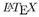
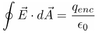

# Yararlanabileceğiniz Kaynaklar, Kavramlar...
Bu başlık altında, araştırma yaparken, benim kullandığım kaynak ve programlardan bahsedeceğim; doğal olarak farklı hocalarınız farklı farklı uygulamalardan faydalanmakta, bunlardan çok daha pratik olanları da şüphesiz var, ama en azından başlangıç açısından örnek teşkil etsin istedim.
* [Wikipedia](https://en.wikipedia.org/wiki/Main_Page): Wikipedia olmasa ne yapardık bilemiyorum. Gerçekten de, Wikipedia makaleleri, bir konuda araştırma yapmaya başlamak için mükemmel bir imkan. Ama burada “başlamak” anahtar kelime. 8) Özellikle de 3. sınıftan itibaren, Wikipedia’da yazanlardan çok, ilgili makalenin kaynakçasını kullanıyor olmalısınız.
* (İleri seviye) [Google Scholar](https://scholar.google.com/): Google’da akademik çalışmalar özelinde aramalar yapabildiğinizi düşünün, işte Google Scholar tam olarak onu sağlamakta. Aradığınız bir konudaki makaleleri bulmak için biçilmiş bir kaftan. Ayrıca, sonuç maddelerinin altlarında yer alan tırnak bağlantısına tıklayarak o makaleyi akademik standarda uygun bir biçimde kaynakçanızda kolaylıkla belirtebilmeniz için seçenekler sunar (o penceredeki _BibTeX_ bağlantısı asıl kahraman ama sonra değineceğiz 8).
* (İleri seviye) [Web of Science](http://www.webofknowledge.com/) & [Scopus](https://www.scopus.com/): Bu iki portal da paralı olup, üniversitemizin bağlantısından erişebilirsiniz. Google Scholar’a benzemekle birlikte, çok daha detaylı akademik aramalar yapmanızı sağlar. Bunlar yardımıyla, bir derginin özelinde arama yapabildiğiniz gibi, bir akademisyenin yayınlarına, birlikte çalıştığı diğer akademisyenlere, konulara da kolaylıkla ulaşabilirsiniz.
* [Kavram] **DOI** (digital object identifier): Her bir dergi, yayınladığı makalelere kendine özgü bir erişim bağlantısı sağladığından, işler kısa sürede çıkmaza girdi ve bu nedenle akademik dünya bu işler için kendisine standart olarak DOI sistemini belirledi. Bir makale nerede yayınlanırsa yayınlansın, kendisine ait, benzersiz (“unique”) bir adres tanımlar. Bu adresi DOI kurumuna bildirip, bu şekilde erişim karmaşıklığı problemini kolayca çözer. Örneğin elinizde *10.1107/S2053273319001748* şeklinde bir DOI varsa, tek yapmanız gereken başına “https://doi.org/” eklemek suretiyle (örneğimizde “https://doi.org/10.1107/S2053273319001748”) tarayıcınıza girmektir, gerisi kendiliğinden hallolup, ilgili makalenin sayfasına yönlendirilirsiniz.
* [Kavram] **Impact factor**: Dergi var, dergi var. Akademik dünyada bir derginin önemi, yayınladığı makalelerin ne kadarının (ve ne kadar) diğer akademisyenler tarafından kullanıldığıyla ölçülür. Bu da kendisine verilen referanslardan ölçülür. Kabaca, etki faktörü 10 olan bir dergide yayınlanan bir makaleye, o yıl ortalama olarak 10 başka makale tarafından referans verilmiş demektir. Örneğin, bilim dünyasının en saygın iki dergisi olan Nature ve Science dergilerinin etki faktörleri (bu metnin yazıldığı tarihte) sırasıyla 24.36 ve 20.57’dir.
* [Kavram] **h-index**: Impact factor nasıl dergilerin etkisini ölçüyorsa, h-index de akademisyenlerin etkisini ölçmede kullanılır. Eğer bir akademisyenin h-index’i 10 ise, bunun anlamı en az 10 referans alan 10 makalesi var demektir (bu akademisyenin sadece 10 makalesinin ya da 100 makalesinin olmasından bağımsızdır). Gördüğünüz üzere akademiye yakışmayan basitlikte bir ölçüm metodu olan h-index’e zaman içerisinde ek olarak başka yöntemler de geliştirilmiştir (örneğin 10’dan fazla alıntıya sahip makale sayısını belirten _i10_ indisi).
* Formüllerin yazımı: Formüllerin yazımı konusunda metin işleme programları (MS Word; Libreoffice/Openoffice Writer; iWork Pages, vs.) birtakım hazır yazılımla gelir ama eğer çok fazla formül giriyorsanız, bunları her seferinde mouse’la ilgili ikona klikle, ilgili alanı seç, ilgili alana girecek formülü tanımla... çok uzar. Tâ 80’li yıllardan itibaren geliştirilmeye başlanan  "[dili](https://en.wikipedia.org/wiki/LaTeX)" size -biraz alışma sürecinden sonra- yazım hızınızda formül girme imkanı sağlar (mouse kullanmadan). Örneğin, Gauss yasasını ifade etmek için şunu yazarsınız: \oint {\vec{E}\cdot d}\vec{A}} = \frac{q_{enc}}{\epsilon_0} – bunu “çevirdiğinizde” ise şunu elde edersiniz:  – bu kadar basit! İşin asıl güzelliği,  epey yaygın bir dil olduğundan, bu yazımı standart olarak Jupyter’dan WordPress’e her türlü yerde hiçbir yeni bir şey öğrenmenize gerek olmadan kolayca ve doğruca kullanabilirsiniz – metin işleme programınızda bile! Mesela, yukarıdaki formülü çıkarmak için \oint... ile başlayan kısmı seçtim ve atadığım kısayol kombinasyonunun tuşlarına bastığım anda saniyesinde formül haline geldi. Bunu da sağolsun Mehmet (Dilaver) Hoca’dan öğrendiğim "[TexMaths](https://extensions.libreoffice.org/en/extensions/show/texmaths-1)" eklentisi sayesinde yaptım (az evvel MS Word için de destek var mı diye ararken, [halihazırda zaten destekle geldiğini görüp çok şaşırdım](https://support.microsoft.com/en-us/office/linear-format-equations-using-unicodemath-and-latex-in-word-2e00618d-b1fd-49d8-8cb4-8d17f25754f8)!).
      Bir tek ödev için  (bu vesileyle “lateks” diye değil de, “latekh” benzeri okunuyor – sondaki harf “X” değil de, Yunan alfabesinden  (chi/kay) ;) öğrenmek tabii ki zorlayıcı ama sonuçta akademisyen olmayı düşünenleriniz için ne kadar erken kullanmaya başlarsanız, o kadar yol alırsınız (ayrıca: bütün metinlerinizi ’de yazmanızı değil de, en azından formülleri o şekilde yazmanızı öğütlüyorum. Yine de bu metni tümden  ile yazma işi ile ilgilenirseniz [LyX](https://www.lyx.org/) adında,  - Word arası bir metin işleme programı var, öncesinde ona bir bakmanızı tavsiye ederim).
* Referanslarınızı metin içerisinde belirtmek, sonra yukarıya yeni bir referans eklediğinde her birini baştan düzenlemek... bunlar ömür törpüsü (sırf bu nedenle “[1]” şeklinde sayısal referans yerine “(Taşcı, 2020)” şeklinde isimsel referans sistemleri daha yaygınlaştı). Bu işlerinizi düzenlemek, otomatikleştirmek adına da referans düzenleyicilerden ben JabRef adında bir yazılım kullanıyorum (yine bu işlerin eskiden LaTeX ile birlikte standardı olan BibTeX'in insancıl arayüzü olarak düşünebilirsiniz), LibreOffice'e entegre edilebiliyor ama lisans seviyesi için çok da şart değil bence -- olur da yüksek lisans+ zamanlarınızda ihtiyaç duyduğunuzda aklınıza gelsin diye burada bahsediyorum.
  
Bu prosedürler umarım akademik hayatınızı kolaylaştırır ve başarınıza etki eder.

[Ana sayfa](README.md)