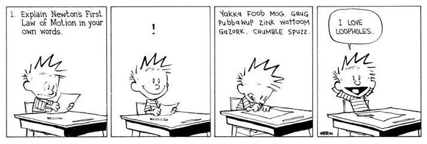

# Ödevler & Raporlar
* Sizlere verilen ödevlerde (hele ki bu uzaktan eğitim sürecinde verilenlerde) amaç sizin google’daki arama, tercüme etme ve kopyala/yapıştır hünerlerinizi ölçmek değildir. Ortaokul dönem ödevinizde belki işe yaramıştır ama akademik ortamda bu ciddi bir suçtur.
* Diğer hocalarınızda sorun olmayabilir ama benim derslerim özelinde:
   * Sınavdan / ödev teslim tarihinden bir gün öncesi – bir gün sonrası aralığında sınav veya ödeve dair bir şey sormayın (tabii ki teknik konular dışında – örneğin sınavın nerede yapılacağını belirtmeyi veya ödevde bahsettiğim görseli eklemeyi unutmuş olabilirim! 8)
   * Teslim / değerlendirme tarihini geciktirmişseniz, mazeretiniz ne olursa olsun ek süre istemeyin. _Bir musibet bin nasihatten iyidir_.
   *  Aksi belirtilmedikçe, dosyanızı e-posta ile değil, sistem üzerinden gönderin: sizlerden günde 30 ile 50 arasında e-posta alıyorum – o anda “tamam” desem bile yine de değerlendirme günü geldiğinde unutmayacağımın hiçbir garantisi maalesef yok.
* Ödevler, ideal olarak, bildiklerinizden yola çıkarak, onlara bir şeyler daha ekleminizi hedefler. Özellikle de ileri sınıf derslerinizde, verilen bir ödevi oturduğunuz koltuktan yorumlayıp cevaplıyorsanız bu çok da iyi bir şey değildir, biraz araştırma yapın (örnek olarak, katıhal fiziği dersini verdiğim dönemde, derste piezoelektrikleri işleyip, piroelektriklerden bahsettikten sonra, soru olarak “blender’ı çok çalıştırınca stop etti, motorunu yaktım sanıp üzüldüm, ama akşama bir kere daha denediğimde tekrar çalıştı – bunun ardında yatan mekanizma sizce ne olabilir?” diye sorduğumda aslında sizin mevcut bilginizle görüşünüze başvurmuyorum. Çok sevdiğim bir öğrencim bu soruyu “çok ilginç bir durum, inanır mısınız bir keresinde benim de saç kurutma makinem aynı şekilde bozulup, ertesi gün çalışmaya başlamıştı” cümlesine benzer bir cevap vermişti. Bu, biraz şuna benziyor:

  Tabii ki sohbet esnasında böyle bir anınızı paylaşmanız normal ama bizim durumumuzda olaya her zaman “hoca bu soruyu sorduysa, dersle alakalı bir cevap bekliyordur” diye bakmanız beklenmekte.
	
  Benzer olarak, bilgisayar programlama dersinde “bölümün girişinde otururken, görme özürlü bir öğrenci sizden yardım isteyip, kendisini bölüm başkanlığına yönlendirmenizi rica ediyor, siz de yoğun olduğunuzdan, kendisinin koluna girip bizzat götüremiyorsunuz, kendisine bölüm başkanlığının yerini nasıl tarif edersiniz?” diye sorduğumda gelen cevaplar arasında “işi gücü bırakıp koluna girer, götürürüm, hiçbir şey doğrudan yardım etmemden daha önemli olamaz”, “bölüm başkanlığının yerini ben de bilmiyorum ki hocam” gibi hayli samimi yanıtlar olsa da, tahmin edersiniz ki o soruyla amacım bunlar değildi. Bölüm başkanlığının yerini bilmiyorsanız, bildiğiniz bir yeri kullanın. Calvin gibi olmayın. 8)
* Birinci sınıflara ödev olarak “yeni kilogram standardı (Mayıs 2019’da yürürlüğe girip, bizleri 100 yıllık platin-iridyum bir silindirin tahakkümünden kurtarıp, Planck sabiti gibi evrensel bir kavrama bağlayarak kurtaran bir standarttan bahsediyoruz bu arada!) hakkında bilgi istediğimde gelen cevaplar arasında kuantum fiziğine dalıp, Schrödinger denklemini ve daha bir sürü karmaşık formülü içeren bilgi deryası fasiküller vardı. Anlamadığınız şeyi yazmayın arkadaşlar (tekrarlamak istiyorum: Bizler ne sizin google’da arama, ne tercüme, ne de kopyalayıp/yapıştırma yeteneklerinizi test ediyoruz).
* Gene yukarıdaki ödeve gelen cevapların çok büyük bir kısmında kaynakça belirtilmemişti. Eğer vahiy yoluyla bir anda aydınlanıp bütün o metni kendi başınıza yazmamışsanız, açık bir hak ihlali (akademide buna aşırmacılık veya intihal diyoruz) yapmış olursunuz. Bir ödevi yaparken araştırma yapıp başka kaynaklardan yararlanmanız ayıp olmadığı gibi, zaten sizden de beklenen bir şeydir. Yeter ki aktardığınız kısımları anlamış olun (kopyala/yapıştır hala ayıp bu arada – bkz. bir sonraki madde).
* Anlayıp anlamamış olduğunuzu kendinizce en kolay test edebileceğiniz yöntem, ödevi araştırdıktan sonra faydalandığınız kaynakları kapatıp, onlara bakmadan -ve bu şartlar altında doğal olarak- kendi cevabınızı yazmanızdır. Tabii ki metnin altına faydalandığınız kaynakları yine belirteceksiniz. “Kaynakça” kısmı sizin kopyalayıp/yapıştırma yaptığınız metinleri değil, faydalandığınız metinleri belirtir. (ayrıca, bir kez daha bkz. bir sonraki madde)
* Eğer -ve özellikle niceliksel bir rapordan faydalanıyorsanız- ille de doğrudan alıntı yapmanız gerekiyorsa, bunun da bir usulü vardır:
  * Eğer alıntıladığınız bir cümle ise, anlatınızın içinde onu tırnak içinde alıntılar, peşinden de referansını belirtirsiniz. Bu şekilde, kaynakta da belirtildiği üzere “hem etik kurallar içinde alıntı yapar, hem okuru da ilgili konuda daha ayrıntılı bilgiye kolayca yönlendirmiş olursunuz” (Taşcı, 2020). (gibi 8)
  * Eğer alıntıladığınız kısım uzunca bir kısım ise, o zaman anlatınıza iki nokta üst üste koyar, tırnağınızı açıp, girinti seviyesini arttırıp, alıntınızı yaparsınız. Örneğin, bir önceki maddeyi alıntılayacaksanız:
    
    &nbsp;&nbsp;&nbsp;&nbsp;&nbsp;&nbsp;“Anlayıp anlamamış olduğunuzu kendinizce en kolay test edebileceğiniz yöntem, ödevi araştırdıktan sonra faydalandığınız kaynakları kapatıp, onlara bakmadan -ve bu şartlar altında doğal olarak- kendi cevabınızı yazmanızdır. Tabii ki metnin altına faydalandığınız kaynakları yine belirteceksiniz. “Kaynakça” kısmı sizin kopyalayıp/yapıştırma yaptığınız metinleri değil, faydalandığınız metinleri belirtir.” (Taşcı, 2020)
 şeklinde, gayet akademik ve etik bir alıntı yapmış olursunuz.
  * Alıntıladığınız metinde başka metinlere gönderme varsa (yani o metinlerde de o kısımlarda kaynakça belirtilmişse) bunları hiçbir şekilde çıkaramazsınız. O kaynak bilgisini çıkarmak demek, ilgili kısmı alıntı yaptığınız kişiye ithaf etmek anlamına geleceğinden, kendi yaptığınız alıntıda kaynak belirtmemekle eşdeğer olur.
      
Alıntı konusunda gayet net bilgiyi (ve fazlasını!) Başkent Üniversitesi’nin hazırlamış olduğu “Akademik Yazım Kuralları Kitapçığı”nda (özellikle sayfa 57’deki “Akademik Aşırmacılık (Plagiarism) başlığı altında ve sonrasında) bulabilirsiniz
       ([https://www.researchgate.net/publication/320226024_Akademik_Yazim_Kurallari_Kitapcigi_5_Baski](https://www.researchgate.net/publication/320226024_Akademik_Yazim_Kurallari_Kitapcigi_5_Baski)).

[Ana sayfa](README.md)
