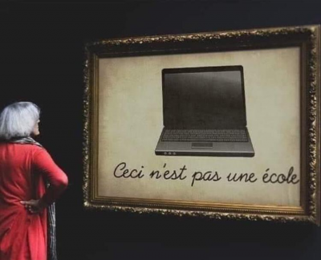
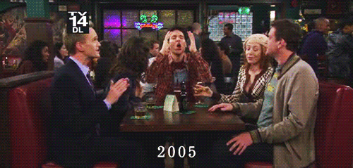
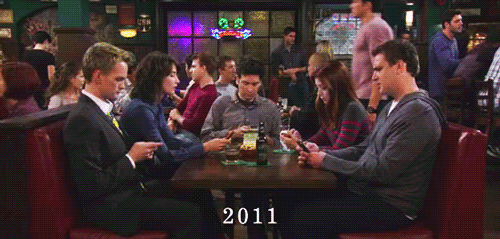

# Uzaktan Eğitim
* Öncelikle: Uzaktan eğitim, yüzyüze eğitimin karşılığı (_muadili_) değildir, olamaz da. Mevcut pandemi şartları altında kaybı mümkün mertebe azaltmaya yönelik bir yaklaşımdır. Magritte'in meşhur ["İmgelerin İhaneti" (_La Trahison des images_)](https://tr.wikipedia.org/wiki/%C4%B0mgelerin_%C4%B0haneti) yapıtında da dile getirdiği üzere, gördüğünüz "bir pipo" değil, bir "pipo resmidir". Bazı zamanlarda bu her ne kadar bariz olsa da, altına yazıp belirtmek gerekiyor:

  
  Bu sistemin de şüphesiz avantajlı olduğu kısımlar var ama bunun geçici bir süreç olduğunu ve zorluklarının da çok olduğunu unutmayın.
* Uzaktan eğitimin zorlukları sizlere de, bizlere de işliyor: örneğin ben ders sunumlarını bu sisteme uygun hale getirmek için epey vakit harcadım, bunun sonucu olarak da ödev ve projeleri vaktinde değerlendiremediğim, geri dönüşleri gönlümce yapamadığım pek çok zaman oldu. Sistem sınavlarda kopya çekmeye çok elverişli olduğundan, bazı hocalarınız daha kısıtlı zamanda, daha zor sorular sorma şeklinde bir yönelime girdi, ben de yazılı sınavları tümden bırakıp, ödev, proje ve sözlülere odaklandım (bana sorsanız iki ara sınav, bir final okumayı tercih ederdim). Hepimiz ayak uydurmaya çalışıyoruz.

Bu süreçte sizlerde gözlemlediğim birkaç noktaya değinirsek:
1. "X kopya çekmek bir yana, sınava kendi yerine bir başkasını sokuyor, ben arkadaşlardan yardım istemişim, çok mu?!" Evet, çok. X'in, Y'nin veya en genel haliyle _siz hariç bütün sınıfın_ yaptığı sizi bağlamaz. X'in yaptıkları hakkında kanıt içeren bir dilekçe ile başvurursanız gereği yapılır, emin olun. Kopya çekmek ahlaki bir sorundur. (nokta)
2. "Hoca nasılsa ders kayıtlarını sisteme yüklüyor / yüklemese de X programı sayesinde rip'leyip, elimin altında tutuyorum, dersi oradan çalışırım." Dersi kayıttan çalıştığınız sürece ne ala fakat ben nasıl indirip biriktirdiğim makeleleri otomatikman okumuş, incelemiş olmuyorsam (ah keşke olabilseydim!), sizler de harddisk'inizde duran kayıtları takip etmediğiniz sürece onlardan faydalanmış olamıyorsunuz. Bu yanılsama (yani "istediğiniz vakit kayıtları oturup izleyebileceğiniz" düşüncesi) maalesef sizi kurtarmıyor -- bize pedagojik formasyonda söyledikleri (ve benim de aklıma yatan) bir husus vardı: en etkili öğrenme metodu görsel ve işitsel metottur. Yani yüz yüze eğitimde hiçbir şey yapmayıp, derse sadece sınıfta katılsanız bile, "kulağınıza bir şeyler giriyordu". Kaba bir formülle, iki haftalık ders izlenmemiş durmaya başladığında, tehlike çanları çok fena halde çalıyor demektir. Bizim zamanımızda "hızlı okuma" vardı, sizin nesilde de "hızlı izleme" oluştu: 2x hızda bile olsa, ders kayıtlarınızı mutlaka baştan sona izleyin, anlamadığınız kısımları not alın, hocanıza mutlaka sorun.
3. **Camera Obscura** ("Karanlık oda" demek - ressamların kullandığı bir teknik, eski usul fotoğraf makineleri de bu prensiple çalışıyordu) Hocalarınıza yardımcı olun. Tepkisiz, bütün kameraların kapalı olduğu bir ortamın motivasyonu ne kadar düşürdüğünü yeterince anlatamam. Ortamınız müsait değildir, yataktan yeni kalkmışsınızdır vs. bunlar anlaşılır ama bütün derslerde kameramı kapayayım, hoca nasıl olsa kameram açık da olsa, kapalı da olsa anlatıyor" diye düşünmek gerçekten büyük bencillik. Bu -biz yaşlı hocaların kendi aramızda dert yanarken saptadığı bir durum- sizler için normal addedilse de, biz (eski kuşak, _kadimler_...) buna hiç alışık değiliz. Analoji olarak derste bir kulağınız bizde olmakla beraber, sürekli olarak cep telefonunuza bakmaya benziyor. "O açmıyor, bu açmıyor, ben niye açayım?" düşüncesinin ne kadar kısır bir döngüye soktuğunun umarım fark edersiniz. Kameranız kapalı olacaksa bile, arada sırada mikrofondan olsun, chat'ten olsun, derse katılın. Bir süre sonra bizler de "banttan" yayın yapmaya başlayıp, canlı dersleri kaldırırsak hoş olmazdı, değil mi? ("Evet." 8)
   Bu konuyla ilgili olarak verdiğim bir de şöyle bir örnek var: 4 arkadaş -eski günlerde- kafede oturuyorsunuz, hepinizin kulağında kulaklık var. Tabii ki size bir soru sorulduğunda kulaklığınızı çıkarıp cevap verirsiniz, ama kulaklığınızın olması sohbete katılımınızı doğrudan etkileyen bir şey. Uykunuz kaçtığında yataktan çıkmadan uyumaya çalışırsınız, yataktan çıktığınızda uykunuzun gelme ihtimali var ama bu ihtimali düşürmüş oluyorsunuz. Yani iletişim kanallarınızı kıstığınızda, iletişim ihtimalini de düşürmüş oluyorsunuz.
   
   
   
   
4. Zoom seansı ve diğer seanslara girdiğinizde kullanıcı adınızı **mutlaka** güncelleyin. "Ahmet'in IPhone'u" sizin için yeterince açıklayıcı olabilir ama özellikle güvenlik kaygısı içerisinde olan bizler için tam bir kabus.
  
Bu konudaki engin ahkamlarım da sanırım şimdilik bu kadar... 8P 8)

[Ana sayfa](README.md)